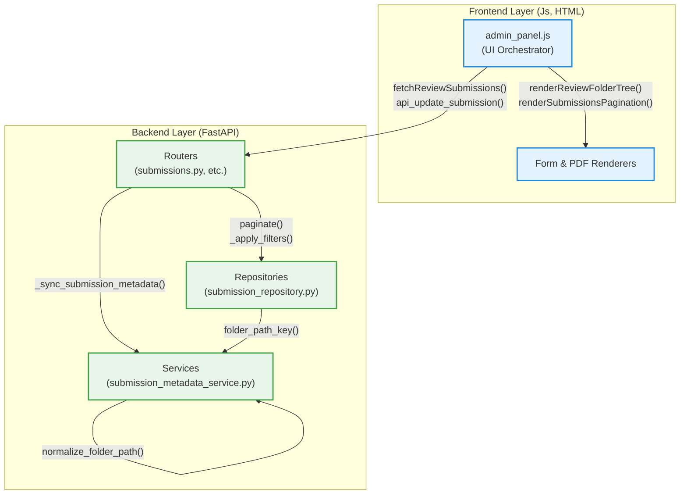

# Scan_to_text Architecture Documentation

## Overview
This document outlines the high-level architecture, functional areas, and critical execution flows of the `Scan_to_text` codebase. This map was generated based on the knowledge graph analysis provided by GitNexus.

## Functional Areas (Clusters)
The codebase is divided into several highly cohesive modules:
- **Js (123 symbols, 79% cohesion):** Core frontend logic managing the admin panel, PDF rendering, and form interactions.
- **Tests (106 symbols, 88% cohesion):** Automated test suites verifying application functionality.
- **Routers (73 symbols, 53% cohesion):** Backend API entry points built with FastAPI, handling HTTP requests for submissions, users, templates, etc.
- **Repositories (67 symbols, 63% cohesion):** Data access layer responsible for database queries, pagination, and filtering.
- **Frontend (32 symbols, 73% cohesion):** HTML/CSS views and structural components of the web application.
- **Services (29 symbols, 66% cohesion):** Backend business logic, metadata synchronization, and path normalization.

## Key Execution Flows (Top Processes)
The application relies heavily on cross-community execution flows that span from the frontend UI to backend data processing:

1. **ReopenSubmissionReview:** `admin_panel.js` orchestrates fetching and rendering submissions by calling `fetchReviewSubmissions`, updating the review folder tree (`renderReviewFolderTree`), fetching specific folder contents (`selectReviewFolder`), and rendering the data table and pagination UI.
2. **Api_get_review_folder_submissions:** The backend router receives a request and delegates to `submission_repository.py` for pagination and filtering. It also interacts with `submission_metadata_service.py` to organize records by `folder_path_key`.
3. **Api_update_submission:** When a submission is updated, the router coordinates with `_sync_submission_metadata`, which calls the service layer (`apply_submission_metadata`, `normalize_folder_path`) to ensure the updated record is properly filed.

## Architecture Diagram

